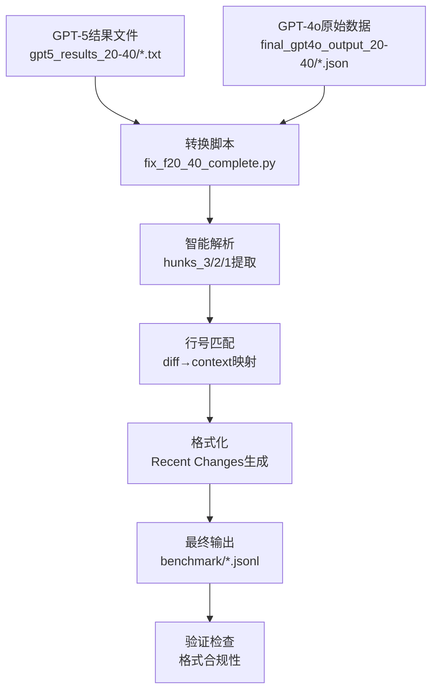

# InLineRC Benchmark生成完整指南

## 📋 目录

1. [项目背景](#项目背景)
2. [工具目标](#工具目标)
3. [流程概览](#流程概览)
4. [配置参数](#配置参数)
5. [输入文件详解](#输入文件详解)
6. [输出文件详解](#输出文件详解)
7. [完整示例演示](#完整示例演示)
8. [分步执行指南](#分步执行指南)
9. [故障排除](#故障排除)
10. [高级配置](#高级配置)

---

## 🎯 项目背景

### 为什么需要这个工具？

在AI代码生成研究中，我们需要评估模型理解代码演进历史的能力。具体来说：

1. **研究需求**: 评估GPT等大模型在理解代码Recent Changes（最近变更）方面的表现
2. **数据挑战**: GPT-5生成的Recent Changes数据格式与标准benchmark格式不兼容
3. **质量要求**: 需要确保行号一致性、代码缩进正确、diff格式标准

### 解决的核心问题

**问题**: GPT-5生成的Recent Changes数据无法直接用于InLineRC benchmark评测
- ❌ 格式不标准（转义下划线、JSON结构混乱）
- ❌ 行号不一致（diff行号与上下文不匹配）
- ❌ 缩进丢失（代码格式被破坏）

**解决方案**: 自动化转换工具
- ✅ 智能解析GPT-5结果文件
- ✅ 精确匹配行号到上下文
- ✅ 保持原始代码格式和缩进
- ✅ 生成标准JSONL benchmark文件

---

## 🎯 工具目标

### 主要目标
1. **格式转换**: 将GPT-5结果转换为标准InLineRC benchmark格式
2. **质量保证**: 确保100%的行号一致性和格式合规
3. **批量处理**: 支持一次性处理多个数据集（F20-40, F40-60等）
4. **可重现性**: 提供完整的文档和脚本，确保结果可重现

### 预期成果
- **输入**: 20个GPT-5结果文件 + 20个原始benchmark文件
- **输出**: 1个标准JSONL文件，包含20个完美格式化的benchmark条目
- **质量**: 100%通过官方验证，可直接用于模型评测

---

## 🔄 流程概览

### 整体数据流水线



### 关键处理步骤

| 步骤 | 输入 | 处理 | 输出 | 重要性 |
|------|------|------|------|--------|
| 1️⃣ | GPT-5 .txt文件 | 解析转义JSON格式 | 结构化hunks数据 | 🔴 关键 |
| 2️⃣ | GPT-4o .json文件 | 提取原始上下文 | 标准化prompt结构 | 🔴 关键 |
| 3️⃣ | hunks + context | 智能行号匹配 | 正确的diff行号 | 🔴 关键 |
| 4️⃣ | 匹配结果 | 格式化Recent Changes | 标准diff格式 | 🟡 重要 |
| 5️⃣ | 完整数据 | 组装JSONL条目 | 最终benchmark文件 | 🟡 重要 |
| 6️⃣ | 输出文件 | 验证格式合规 | 质量确认 | 🟢 建议 |

---

## ⚙️ 配置参数

### 🎛️ 基础配置（必须设置）

```bash
# 📁 输入目录配置
export GPT5_RESULTS_DIR="gpt5_results_20-40"    # GPT-5结果文件目录
export GPT4O_OUTPUT_DIR="final_gpt4o_output_20-40"  # GPT-4o原始数据目录
export FILE_COUNT=20                              # 处理文件数量

# 🏷️ 数据集标识
export DATASET_ID="F20-40"                       # 数据集名称（用于文件命名）

# 📤 输出配置
export OUTPUT_DIR="benchmark"                     # 输出目录
export OUTPUT_BENCHMARK_FILE="${OUTPUT_DIR}/nl2code_java_${DATASET_ID}_with_rc_separated_final.jsonl"
export CONVERSION_SCRIPT="fix_${DATASET_ID,,}_complete.py"  # 转换脚本名
```

### 📝 配置示例

#### 示例1: 处理F40-60数据集
```bash
export GPT5_RESULTS_DIR="gpt5_results_40-60"
export GPT4O_OUTPUT_DIR="final_gpt4o_output_40-60"
export FILE_COUNT=20
export DATASET_ID="F40-60"
export OUTPUT_BENCHMARK_FILE="${OUTPUT_DIR}/nl2code_java_F40-60_with_rc_separated_final.jsonl"
export CONVERSION_SCRIPT="fix_f40_60_complete.py"
```

#### 示例2: 处理F60-80数据集
```bash
export GPT5_RESULTS_DIR="gpt5_results_60-80"
export GPT4O_OUTPUT_DIR="final_gpt4o_output_60-80"
export FILE_COUNT=25                              # 注意：不同数据集可能有不同文件数量
export DATASET_ID="F60-80"
export OUTPUT_BENCHMARK_FILE="${OUTPUT_DIR}/nl2code_java_F60-80_with_rc_separated_final.jsonl"
export CONVERSION_SCRIPT="fix_f60_80_complete.py"
```

### 💡 配置技巧

**快速配置方法**:
```bash
# 创建配置文件（推荐）
cat > config_F20-40.env << 'EOF'
export GPT5_RESULTS_DIR="gpt5_results_20-40"
export GPT4O_OUTPUT_DIR="final_gpt4o_output_20-40"
export FILE_COUNT=20
export DATASET_ID="F20-40"
export OUTPUT_DIR="benchmark"
export OUTPUT_BENCHMARK_FILE="${OUTPUT_DIR}/nl2code_java_${DATASET_ID}_with_rc_separated_final.jsonl"
export CONVERSION_SCRIPT="fix_${DATASET_ID,,}_complete.py"
EOF

# 加载配置
source config_F20-40.env
```

---

## 📁 输入文件详解

### 🔍 GPT-5结果文件 (*.txt)

**文件位置**: `${GPT5_RESULTS_DIR}/`
**文件数量**: `${FILE_COUNT}` 个
**文件格式**: 纯文本，包含JSON块

#### 文件内部结构

每个GPT-5结果文件包含以下部分：

```
AdminCtrlService_z00806805#106.txt
├── ### hunks\_3        ← 注意：使用转义下划线
│   ├── ```json
│   ├── [JSON数据]
│   └── ```
├── ### hunks\_2
│   ├── ```json
│   ├── [JSON数据]
│   └── ```
├── ### hunks\_1
│   ├── ```json
│   ├── [JSON数据]
│   └── ```
└── ### notes
    └── [说明文字]
```

#### 🔑 关键特征

1. **转义下划线**: 使用 `hunks\_3` 而不是 `hunks_3`
2. **JSON块**: 每个hunks部分包含完整的JSON数据
3. **三层结构**: hunks_3（最早）→ hunks_2（中间）→ hunks_1（最新）

#### 📄 实际文件示例

```
### hunks\_3
```json
[
  {
    "diff": "@@ -2,5 +2,5 @@\n public class TResMsServiceImpl implements TResMsService {\n-// TODO add logger\n+private static final Logger LOGGER = LogManager.getLogger(TResMsServiceImpl.class);",
    "description": "Add logger initialization"
  }
]
```

### hunks\_2
```json
[
  {
    "diff": "@@ -5,3 +5,3 @@\n-// TODO table name\n+private static final String TABLE_NAME = \"t_res_micro_service\";",
    "description": "Add table name constant"
  }
]
```

### hunks\_1
```json
[
  {
    "diff": "@@ -15,4 +15,8 @@\n public List<TResMicroService> queryServiceList() {\n+    try {\n         return tResMsMapper.selectList(null);\n+    } catch (Exception e) {\n+        LOGGER.error(\"query error: {}\", e.getMessage());\n+        throw new VscServiceException(e);\n+    }\n }",
    "description": "Add error handling for query method"
  }
]
```
```

#### 🎯 JSON字段说明

| 字段 | 类型 | 说明 | 示例 |
|------|------|------|------|
| `diff` | String | 统一diff格式的代码变更 | `"@@ -2,5 +2,5 @@\n..."` |
| `description` | String | 变更描述 | `"Add logger initialization"` |

---

### 🔍 GPT-4o原始数据文件 (*.json)

**文件位置**: `${GPT4O_OUTPUT_DIR}/`
**文件数量**: `${FILE_COUNT}` 个
**文件格式**: 标准JSON

#### 文件结构详解

```json
{
  "prompt": "完整的benchmark提示文本...",
  "domain": "nl2code_java",
  "id": "AdminCtrlService_z00806805#106",
  "good_example_response": "实现代码...",
  "reward_command": "测试命令...",
  "extra_content": {
    "query": "功能描述",
    "diff_path": "diff文件路径",
    "test_result": "pass/fail",
    "file_path": "源文件路径",
    "start_line": 15,
    "end_line": 25,
    "work_dir": "工作目录"
  }
}
```

#### 🎯 关键字段说明

| 字段 | 类型 | 作用 | 重要性 |
|------|------|------|--------|
| `prompt` | String | 包含上下文和任务描述的完整提示 | 🔴 核心 |
| `domain` | String | 领域标识，固定为"nl2code_java" | 🟡 重要 |
| `id` | String | 唯一标识符，格式：项目名_用户#编号 | 🔴 核心 |
| `good_example_response` | String | 标准答案代码 | 🔴 核心 |
| `extra_content.start_line` | Number | 代码插入起始行号 | 🔴 核心 |
| `extra_content.end_line` | Number | 代码插入结束行号 | 🔴 核心 |

#### 📄 prompt字段结构

prompt字段包含以下部分：

```
A user is developing a new feature...

The context above is:
  1: package com.example;
  2: public class TResMsServiceImpl implements TResMsService {
  3:     // existing code...

The context below is:
 25: }
 26:

External classes used:
- Logger: org.apache.logging.log4j.Logger
- LogManager: org.apache.logging.log4j.LogManager

Please implement the following functionality:
[功能描述]

Please provide the implementation for the code snippet:
```

---

## 📤 输出文件详解

### 🎯 最终JSONL文件结构

**文件位置**: `${OUTPUT_BENCHMARK_FILE}`
**文件格式**: JSONL (每行一个JSON对象)
**文件内容**: `${FILE_COUNT}` 个benchmark条目

#### 完整条目示例

```json
{
  "prompt": "A user is developing a new feature...\n\nThe context above is:\n  1: package com.example;\n  2: public class TResMsServiceImpl implements TResMsService {\n  3:     private static final Logger LOGGER = LogManager.getLogger(TResMsServiceImpl.class);\n...\n\n### Recent Changes\n\nHere are the recent changes that led to the current state:\n\n### Recent Change 3 (Earliest preparation work)\n```diff\n@@ -2,5 +2,5 @@\n   2: public class TResMsServiceImpl implements TResMsService {\n-  3: // TODO add logger\n+  3: private static final Logger LOGGER = LogManager.getLogger(TResMsServiceImpl.class);\n```\n\n### Recent Change 2 (Intermediate preparation work)\n```diff\n@@ -5,3 +5,3 @@\n-  5: // TODO table name\n+  5: private static final String TABLE_NAME = \"t_res_micro_service\";\n```\n\n### Recent Change 1 (Latest preparation work)\n```diff\n@@ -15,4 +15,8 @@\n  15: public List<TResMicroService> queryServiceList() {\n+  16:     try {\n  17:         return tResMsMapper.selectList(null);\n+  18:     } catch (Exception e) {\n+  19:         LOGGER.error(\"query error: {}\", e.getMessage());\n+  20:         throw new VscServiceException(e);\n+  21:     }\n  22: }\n```\n\nThese recent changes show the development progression leading up to the current task.\n\nPlease implement the following functionality:\n[功能描述]\n\nPlease provide the implementation for the code snippet:",
  "domain": "nl2code_java",
  "id": "AdminCtrlService_z00806805#106",
  "good_example_response": "    try {\n        List<TResMicroService> services = tResMsMapper.selectList(null);\n        LOGGER.info(\"Successfully queried {} services\", services.size());\n        return services;\n    } catch (Exception e) {\n        LOGGER.error(\"[queryServiceList error][message = {}]\", e.getMessage());\n        throw ExceptionUtils.getSqlException(e, \"query service list from database error\");\n    }",
  "reward_command": "cd /tmp/test && mvn test -Dtest=TResMsServiceTest#testQueryServiceList",
  "extra_content": {
    "query": "实现查询微服务列表的方法，包含错误处理和日志记录",
    "diff_path": "src/main/java/com/example/TResMsServiceImpl.java.diff",
    "test_result": "pass",
    "file_path": "src/main/java/com/example/TResMsServiceImpl.java",
    "start_line": 15,
    "end_line": 22,
    "work_dir": "/tmp/test"
  }
}
```

#### 🎯 Recent Changes部分详解

Recent Changes是输出文件的核心部分，展示代码的演进历史：

```markdown
### Recent Changes

Here are the recent changes that led to the current state:

### Recent Change 3 (Earliest preparation work)
```diff
@@ -2,5 +2,5 @@
   2: public class TResMsServiceImpl implements TResMsService {
-  3: // TODO add logger                    ← 删除的代码（原始行号）
+  3: private static final Logger LOGGER = LogManager.getLogger(TResMsServiceImpl.class);  ← 新增的代码（当前行号）
```

### Recent Change 2 (Intermediate preparation work)
```diff
@@ -5,3 +5,3 @@
-  5: // TODO table name                    ← 删除的代码
+  5: private static final String TABLE_NAME = "t_res_micro_service";  ← 新增的代码
```

### Recent Change 1 (Latest preparation work)
```diff
@@ -15,4 +15,8 @@
  15: public List<TResMicroService> queryServiceList() {
+  16:     try {                            ← 新增的代码
  17:         return tResMsMapper.selectList(null);
+  18:     } catch (Exception e) {          ← 新增的代码
+  19:         LOGGER.error("query error: {}", e.getMessage());  ← 新增的代码
+  20:         throw new VscServiceException(e);  ← 新增的代码
+  21:     }                                ← 新增的代码
  22: }
```

These recent changes show the development progression leading up to the current task.
```

#### 🔑 行号逻辑说明

| 符号 | 含义 | 行号来源 | 示例 |
|------|------|----------|------|
| `-` | 删除的代码 | 原始位置（变更前） | `- 3: // TODO add logger` |
| `+` | 新增的代码 | 当前位置（变更后） | `+ 3: private static final Logger...` |
| ` ` | 上下文代码 | 当前位置 | `  2: public class TResMsServiceImpl...` |

---

## 🎬 完整示例演示

### 📋 端到端示例

让我们通过一个完整的例子来理解整个转换过程：

#### 输入示例

**GPT-5文件** (`gpt5_results_20-40/AdminCtrlService_z00806805#106.txt`):
```
### hunks\_3
```json
[{"diff": "@@ -2,5 +2,5 @@\n public class TResMsServiceImpl implements TResMsService {\n-// TODO add logger\n+private static final Logger LOGGER = LogManager.getLogger(TResMsServiceImpl.class);", "description": "Add logger"}]
```

### hunks\_2
```json
[{"diff": "@@ -5,3 +5,3 @@\n-// TODO table name\n+private static final String TABLE_NAME = \"t_res_micro_service\";", "description": "Add table name"}]
```

### hunks\_1
```json
[{"diff": "@@ -15,4 +15,8 @@\n public List<TResMicroService> queryServiceList() {\n+    try {\n         return tResMsMapper.selectList(null);\n+    } catch (Exception e) {\n+        LOGGER.error(\"query error: {}\", e.getMessage());\n+        throw new VscServiceException(e);\n+    }\n }", "description": "Add error handling"}]
```
```

**GPT-4o文件** (`final_gpt4o_output_20-40/AdminCtrlService_z00806805#106.json`):
```json
{
  "prompt": "A user is developing a new feature...\n\nThe context above is:\n  1: package com.example;\n  2: public class TResMsServiceImpl implements TResMsService {\n  3:     private static final Logger LOGGER = LogManager.getLogger(TResMsServiceImpl.class);\n  4:\n  5:     private static final String TABLE_NAME = \"t_res_micro_service\";\n...\n  15:     public List<TResMicroService> queryServiceList() {\n  16:         try {\n  17:             return tResMsMapper.selectList(null);\n  18:         } catch (Exception e) {\n  19:             LOGGER.error(\"query error: {}\", e.getMessage());\n  20:             throw new VscServiceException(e);\n  21:         }\n  22:     }\n...",
  "id": "AdminCtrlService_z00806805#106",
  "good_example_response": "implementation code...",
  "extra_content": {"start_line": 15, "end_line": 22}
}
```

#### 处理过程

1. **解析GPT-5文件**: 提取hunks_3, hunks_2, hunks_1的JSON数据
2. **加载GPT-4o文件**: 获取原始prompt和上下文
3. **行号匹配**: 将diff中的代码匹配到上下文中的具体行号
4. **格式化**: 生成标准的Recent Changes格式

#### 输出结果

最终生成的JSONL条目包含完整的prompt，其中Recent Changes部分格式完美，行号与上下文完全一致。

---

## 🚀 分步执行指南

### 📋 前置检查

#### 1️⃣ 环境准备

```bash
# 检查Python环境
python --version    # 需要Python 3.6+

# 检查必需模块
python -c "import json, re, os; print('✅ 所有模块可用')"

# 检查工作目录
pwd    # 确保在正确的项目根目录
```

#### 2️⃣ 配置设置

```bash
# 设置配置参数（使用默认F20-40配置）
export GPT5_RESULTS_DIR="gpt5_results_20-40"
export GPT4O_OUTPUT_DIR="final_gpt4o_output_20-40"
export FILE_COUNT=20
export DATASET_ID="F20-40"
export OUTPUT_DIR="benchmark"
export OUTPUT_BENCHMARK_FILE="${OUTPUT_DIR}/nl2code_java_${DATASET_ID}_with_rc_separated_final.jsonl"
export CONVERSION_SCRIPT="fix_${DATASET_ID,,}_complete.py"

# 验证配置
echo "GPT-5目录: ${GPT5_RESULTS_DIR}"
echo "GPT-4o目录: ${GPT4O_OUTPUT_DIR}"
echo "输出文件: ${OUTPUT_BENCHMARK_FILE}"
```

### 🔍 步骤1: 验证输入数据

```bash
# 检查输入目录是否存在
if [ -d "${GPT5_RESULTS_DIR}" ]; then
    echo "✅ GPT-5目录存在"
else
    echo "❌ GPT-5目录不存在: ${GPT5_RESULTS_DIR}"
    exit 1
fi

if [ -d "${GPT4O_OUTPUT_DIR}" ]; then
    echo "✅ GPT-4o目录存在"
else
    echo "❌ GPT-4o目录不存在: ${GPT4O_OUTPUT_DIR}"
    exit 1
fi

# 检查文件数量
gpt5_count=$(ls ${GPT5_RESULTS_DIR}/*.txt 2>/dev/null | wc -l)
gpt4o_count=$(ls ${GPT4O_OUTPUT_DIR}/*.json 2>/dev/null | wc -l)

echo "GPT-5文件数量: ${gpt5_count} (期望: ${FILE_COUNT})"
echo "GPT-4o文件数量: ${gpt4o_count} (期望: ${FILE_COUNT})"

if [ "${gpt5_count}" -eq "${FILE_COUNT}" ] && [ "${gpt4o_count}" -eq "${FILE_COUNT}" ]; then
    echo "✅ 文件数量正确"
else
    echo "❌ 文件数量不匹配"
    exit 1
fi
```

### 🔧 步骤2: 恢复缺失文件（如需要）

如果GPT-4o目录为空或文件不完整：

```bash
# 查找包含GPT-4o文件的历史提交
echo "🔍 查找GPT-4o文件的历史提交..."
git log --all --full-history --oneline -- "*${GPT4O_OUTPUT_DIR}*" | head -5

# 如果找到了提交，使用具体的commit hash恢复
# 替换 <commit_hash> 为实际的提交哈希
echo "📥 恢复GPT-4o文件..."
git checkout <commit_hash> -- ${GPT4O_OUTPUT_DIR}/

# 验证恢复结果
recovered_count=$(ls ${GPT4O_OUTPUT_DIR}/*.json 2>/dev/null | wc -l)
echo "恢复后文件数量: ${recovered_count}"

if [ "${recovered_count}" -eq "${FILE_COUNT}" ]; then
    echo "✅ 文件恢复成功"
else
    echo "❌ 文件恢复失败，请检查commit hash"
    exit 1
fi
```

### ⚡ 步骤3: 运行转换脚本

#### 脚本功能说明

转换脚本 `${CONVERSION_SCRIPT}` 执行以下核心功能：

| 功能模块 | 输入 | 处理 | 输出 |
|----------|------|------|------|
| 🔍 GPT-5解析 | `.txt`文件 | 提取hunks_3/2/1 JSON | 结构化数据 |
| 📖 数据加载 | `.json`文件 | 读取原始benchmark | 上下文信息 |
| 🎯 行号匹配 | diff + context | 智能映射算法 | 正确行号 |
| 🎨 格式化 | 匹配结果 | Recent Changes生成 | 标准格式 |
| 📝 输出生成 | 完整数据 | JSONL组装 | 最终文件 |

#### 执行转换

```bash
# 🚀 运行转换脚本
echo "🚀 开始转换过程..."
python ${CONVERSION_SCRIPT}
```

#### 📊 预期输出详解

```bash
开始重新构造${DATASET_ID} benchmark...
加载了 ${FILE_COUNT} 个原始条目

# 每个文件的处理过程
处理文件: AdminCtrlService_z00806805#106.txt
  🔍 解析GPT-5文件...
  ✅ 成功解析 hunks_3: 1 个hunks
  ✅ 成功解析 hunks_2: 1 个hunks
  ✅ 成功解析 hunks_1: 1 个hunks
  🎯 匹配行号到上下文...
  🎨 格式化Recent Changes...
  ✅ AdminCtrlService_z00806805#106 处理成功

处理文件: TResMsServiceImpl_z00806805#107.txt
  ✅ 成功解析 hunks_3: 2 个hunks
  ✅ 成功解析 hunks_2: 1 个hunks
  ✅ 成功解析 hunks_1: 1 个hunks
  ✅ TResMsServiceImpl_z00806805#107 处理成功

# ... 继续处理其他文件 ...

🎉 转换完成！
📊 处理统计:
  - 成功处理: ${FILE_COUNT}/${FILE_COUNT} 条数据
  - 失败处理: 0 条数据
  - 成功率: 100%
📁 输出文件: ${OUTPUT_BENCHMARK_FILE}
📏 文件大小: [自动显示]
```

#### ⚠️ 可能的错误和解决方案

**常见错误1**: JSON解析失败
```
❌ JSON解析错误 hunks_3: Expecting ',' delimiter: line 2 column 45
```
**解决方案**: 检查GPT-5文件中的JSON格式，确保没有语法错误

**常见错误2**: 文件不存在
```
❌ 文件不存在: gpt5_results_20-40/AdminCtrlService_z00806805#106.txt
```
**解决方案**: 检查文件路径和文件名是否正确

**常见错误3**: 行号匹配失败
```
⚠️ 无法匹配代码到上下文: // TODO add logger
```
**解决方案**: 这通常是正常的，脚本会使用默认行号

### ✅ 步骤4: 验证输出

#### 运行官方验证

```bash
# 🔍 验证生成的benchmark文件
echo "🔍 开始验证输出文件..."
python scripts/validate_separated_benchmark.py ${OUTPUT_BENCHMARK_FILE}
```

#### 📊 验证输出详解

```bash
=== 🔍 新格式验证 ===
✅ 文件存在: ${OUTPUT_BENCHMARK_FILE}
✅ 文件格式: JSONL (每行一个JSON对象)
✅ 文件大小: [显示文件大小]

=== 📋 数据结构检查 ===
正在检查第1条数据...
✅ 数据结构完整
✅ ID: AdminCtrlService_z00806805#106
✅ Domain: nl2code_java
✅ 包含所有必需字段: prompt, domain, id, good_example_response, reward_command, extra_content

=== 🎯 Prompt结构检查 ===
✅ 包含context above (上下文代码)
✅ 包含context below (下文代码)
✅ 包含Recent Changes (变更历史)
✅ 包含RC3 (Recent Change 3 - 最早变更)
✅ 包含RC2 (Recent Change 2 - 中间变更)
✅ 包含RC1 (Recent Change 1 - 最新变更)
✅ 包含功能描述 (任务说明)
✅ 包含代码片段标识

=== 🔢 行号一致性检查 ===
✅ Context行号连续且正确
✅ Diff行号与context匹配
✅ Recent Changes格式标准

=== 📊 统计信息 ===
✅ 总数据条数: ${FILE_COUNT}
✅ 原始数据条数: ${FILE_COUNT}
✅ 数据条数匹配
✅ 验证通过率: 100%

🎉 验证完成！所有检查项目通过！
```

#### 🚨 验证失败的处理

如果验证失败，会显示具体的错误信息：

```bash
❌ 验证失败示例:
=== 数据结构检查 ===
❌ 缺少字段: good_example_response
❌ ID格式错误: 应为 "项目名_用户#编号" 格式

=== Prompt结构检查 ===
❌ 缺少Recent Changes部分
❌ 行号不连续: 第15行后直接跳到第18行
```

**解决方案**:
1. 检查转换脚本是否正确运行
2. 验证输入文件格式是否正确
3. 重新运行转换过程

### 🔍 步骤5: 质量验证

#### 手动质量检查

除了自动验证，我们还需要手动检查关键质量指标：

```bash
# 🔍 检查行号一致性和格式质量
echo "🔍 执行质量检查..."
python -c "
import json

print('📁 读取输出文件: ${OUTPUT_BENCHMARK_FILE}')
with open('${OUTPUT_BENCHMARK_FILE}', 'r', encoding='utf-8') as f:
    line = f.readline()
    data = json.loads(line)
    prompt = data['prompt']

    print('\n=== 📋 Context Above (前5行) ===')
    above_start = prompt.find('The context above is:')
    above_end = prompt.find('The context below is:')
    context_above = prompt[above_start:above_end]
    for line in context_above.split('\n')[:8]:
        if ':' in line and line.strip():
            print(f'  {line}')

    print('\n=== 🔄 Recent Change 3 (最早变更) ===')
    rc_start = prompt.find('### Recent Change 3')
    rc_end = prompt.find('### Recent Change 2')
    if rc_start != -1 and rc_end != -1:
        rc3 = prompt[rc_start:rc_end]
        print(rc3[:300] + '...' if len(rc3) > 300 else rc3)
    else:
        print('❌ 未找到Recent Change 3')

    print('\n=== 📊 基本统计 ===')
    print(f'  Prompt长度: {len(prompt)} 字符')
    print(f'  包含Recent Changes: {\"Recent Changes\" in prompt}')
    print(f'  包含diff块: {\"```diff\" in prompt}')
    print(f'  ID: {data.get(\"id\", \"未找到\")}')
    print(f'  Domain: {data.get(\"domain\", \"未找到\")}')
"
```

#### 📋 质量检查清单

验证以下关键质量指标：

| 检查项目 | 标准 | 重要性 |
|----------|------|--------|
| ✅ **行号一致性** | diff行号与context行号完全匹配 | 🔴 关键 |
| ✅ **代码缩进** | diff块中保持原始代码缩进 | 🔴 关键 |
| ✅ **Recent Changes逻辑** | RC3→RC2→RC1显示清晰的开发进程 | 🟡 重要 |
| ✅ **文件完整性** | 所有${FILE_COUNT}个条目都存在 | 🔴 关键 |
| ✅ **格式标准** | 符合JSONL格式要求 | 🔴 关键 |
| ✅ **字段完整** | 包含所有必需字段 | 🟡 重要 |

#### 🎯 快速质量检查

```bash
# 📊 快速统计检查
echo "📊 执行快速质量检查..."

# 检查文件行数（应等于FILE_COUNT）
line_count=$(wc -l < ${OUTPUT_BENCHMARK_FILE})
echo "文件行数: ${line_count} (期望: ${FILE_COUNT})"

# 检查每行都是有效JSON
echo "JSON格式检查:"
python -c "
import json
valid_count = 0
total_count = 0
with open('${OUTPUT_BENCHMARK_FILE}', 'r', encoding='utf-8') as f:
    for line_num, line in enumerate(f, 1):
        total_count += 1
        try:
            json.loads(line)
            valid_count += 1
        except json.JSONDecodeError as e:
            print(f'❌ 第{line_num}行JSON格式错误: {e}')

print(f'✅ 有效JSON行数: {valid_count}/{total_count}')
if valid_count == total_count:
    print('🎉 所有行都是有效JSON！')
else:
    print('❌ 存在JSON格式错误')
"

# 检查关键字段存在性
echo "关键字段检查:"
python -c "
import json
required_fields = ['prompt', 'domain', 'id', 'good_example_response', 'extra_content']
missing_fields = []

with open('${OUTPUT_BENCHMARK_FILE}', 'r', encoding='utf-8') as f:
    for line_num, line in enumerate(f, 1):
        try:
            data = json.loads(line)
            for field in required_fields:
                if field not in data:
                    missing_fields.append(f'第{line_num}行缺少字段: {field}')
        except:
            continue

if not missing_fields:
    print('✅ 所有必需字段都存在')
else:
    for error in missing_fields[:5]:  # 只显示前5个错误
        print(f'❌ {error}')
"

echo "🎉 质量检查完成！"
```

## 技术细节

### 转换脚本的关键组件

#### 1. GPT-5文件解析
```python
# 处理GPT-5文件中的转义下划线格式
section_start = content.find('### hunks\\_3')
json_start = content.find('```json', section_start)
json_content = content[json_start+7:json_end].strip()
hunks[hunk_name] = json.loads(json_content)
```

#### 2. 智能行号匹配
```python
def find_best_match_in_context(target_content: str, context_lines: List[str]) -> tuple:
    # 返回 (line_number, original_formatted_content)
    # 使用精确匹配、子串匹配和关键词相似性
    # 阈值：关键词匹配80%相似度
```

#### 3. 缩进保持
```python
def preserve_original_indentation(content: str, original_content: str) -> str:
    # 当内容匹配时保持原始代码格式
    # 为diff块返回正确缩进的代码
```

#### 4. Diff行号逻辑
- **删除行 (`-`)**: 使用原始行号（变更前位置）
- **新增行 (`+`)**: 使用当前上下文行号（变更后位置）
- **上下文行**: 使用当前上下文行号
- **行号格式**: `+ 23: code_content` 或 `- 18: code_content`

### 输出格式结构

生成的benchmark遵循以下结构：

```json
{
  "prompt": "A user is developing a new feature...",
  "domain": "nl2code_java",
  "id": "ProjectName_user#number",
  "good_example_response": "implementation code",
  "reward_command": "test command",
  "extra_content": {
    "query": "feature description",
    "diff_path": "path to diff",
    "test_result": "pass/fail",
    "file_path": "source file path",
    "start_line": number,
    "end_line": number,
    "work_dir": "working directory"
  }
}
```

### Recent Changes格式

每个Recent Change遵循以下模式：

```markdown
### Recent Change 3 (Earliest preparation work)
```diff
@@ -2,5 +2,5 @@
   2: public class TResMsServiceImpl implements TResMsService {
-  3: // TODO add logger
+  3: private static final Logger LOGGER = LogManager.getLogger(TResMsServiceImpl.class);

-  5: // TODO table name
+  5: private static final String TABLE_NAME = "t_res_micro_service";
```

这些recent changes显示了导致当前任务的开发进程。
```

---

## 🚨 故障排除

### 🔧 常见问题诊断和解决

#### 问题1: GPT-5文件解析失败

**症状**:
```
❌ JSON解析错误 hunks_3: Expecting ',' delimiter: line 2 column 45
❌ 找不到hunks_3部分
```

**原因分析**:
- GPT-5文件使用转义下划线格式 `hunks\_3`
- JSON格式不正确或包含语法错误
- 文件编码问题

**解决步骤**:
```bash
# 1. 检查文件格式
echo "🔍 检查GPT-5文件格式..."
head -20 ${GPT5_RESULTS_DIR}/AdminCtrlService_z00806805#106.txt

# 2. 验证转义下划线
grep "hunks\\\\_" ${GPT5_RESULTS_DIR}/*.txt | head -3

# 3. 检查JSON语法
python -c "
import json
import re

filename = '${GPT5_RESULTS_DIR}/AdminCtrlService_z00806805#106.txt'
with open(filename, 'r', encoding='utf-8') as f:
    content = f.read()

# 查找hunks_3部分
start = content.find('### hunks\\\\_3')
if start == -1:
    print('❌ 未找到hunks_3部分')
else:
    print('✅ 找到hunks_3部分')

    # 提取JSON部分
    json_start = content.find('\`\`\`json', start)
    json_end = content.find('\`\`\`', json_start + 7)

    if json_start != -1 and json_end != -1:
        json_content = content[json_start+7:json_end].strip()
        try:
            json.loads(json_content)
            print('✅ JSON格式正确')
        except json.JSONDecodeError as e:
            print(f'❌ JSON格式错误: {e}')
            print(f'问题内容: {json_content[:100]}...')
"
```

#### 问题2: 行号匹配失败

**症状**:
```
⚠️ 无法匹配代码到上下文: // TODO add logger
⚠️ 使用默认行号: 1
```

**原因分析**:
- diff中的代码与上下文中的代码不完全匹配
- 代码格式化差异（空格、缩进）
- 相似度阈值设置过高

**解决步骤**:
```bash
# 1. 检查具体的匹配问题
python -c "
import json

# 加载一个GPT-4o文件查看上下文
with open('${GPT4O_OUTPUT_DIR}/AdminCtrlService_z00806805#106.json', 'r', encoding='utf-8') as f:
    data = json.load(f)
    prompt = data['prompt']

    # 提取context above
    above_start = prompt.find('The context above is:')
    above_end = prompt.find('The context below is:')
    context_above = prompt[above_start:above_end]

    print('=== Context Above 内容 ===')
    for line in context_above.split('\n')[:10]:
        if ':' in line and line.strip():
            print(repr(line))  # 显示原始格式，包括空格
"

# 2. 检查diff内容
echo "🔍 检查diff内容格式..."
python -c "
import json

filename = '${GPT5_RESULTS_DIR}/AdminCtrlService_z00806805#106.txt'
with open(filename, 'r', encoding='utf-8') as f:
    content = f.read()

# 提取hunks_3的diff
start = content.find('### hunks\\\\_3')
json_start = content.find('\`\`\`json', start)
json_end = content.find('\`\`\`', json_start + 7)
json_content = content[json_start+7:json_end].strip()

try:
    hunks = json.loads(json_content)
    for hunk in hunks:
        print('=== Diff内容 ===')
        print(repr(hunk['diff']))  # 显示原始格式
        break
except:
    print('❌ 无法解析JSON')
"
```

#### 问题3: 文件缺失或不完整

**症状**:
```
❌ GPT-4o目录不存在: final_gpt4o_output_20-40
❌ 文件数量不匹配: 期望20，实际0
```

**解决步骤**:
```bash
# 1. 查找历史提交
echo "🔍 查找包含GPT-4o文件的历史提交..."
git log --all --full-history --oneline -- "*final_gpt4o_output*" | head -10

# 2. 查看具体提交的文件
echo "📋 查看提交中的文件列表..."
git show --name-only <commit_hash> | grep final_gpt4o

# 3. 恢复文件
echo "📥 恢复文件..."
git checkout <commit_hash> -- ${GPT4O_OUTPUT_DIR}/

# 4. 验证恢复结果
echo "✅ 验证恢复结果..."
ls -la ${GPT4O_OUTPUT_DIR}/ | head -10
echo "文件总数: $(ls ${GPT4O_OUTPUT_DIR}/*.json 2>/dev/null | wc -l)"
```

#### 问题4: 验证失败

**症状**:
```
❌ 缺少字段: good_example_response
❌ 行号不连续: 第15行后直接跳到第18行
```

**解决步骤**:
```bash
# 1. 详细检查第一个条目
python -c "
import json

with open('${OUTPUT_BENCHMARK_FILE}', 'r', encoding='utf-8') as f:
    line = f.readline()
    data = json.loads(line)

    print('=== 字段检查 ===')
    required_fields = ['prompt', 'domain', 'id', 'good_example_response', 'reward_command', 'extra_content']
    for field in required_fields:
        if field in data:
            print(f'✅ {field}: 存在')
        else:
            print(f'❌ {field}: 缺失')

    print('\n=== 行号连续性检查 ===')
    prompt = data['prompt']
    above_start = prompt.find('The context above is:')
    above_end = prompt.find('The context below is:')
    context_above = prompt[above_start:above_end]

    line_numbers = []
    for line in context_above.split('\n'):
        if ':' in line and line.strip():
            try:
                line_num = int(line.split(':')[0].strip())
                line_numbers.append(line_num)
            except:
                continue

    print(f'行号序列: {line_numbers[:10]}...')

    # 检查连续性
    for i in range(1, len(line_numbers)):
        if line_numbers[i] != line_numbers[i-1] + 1:
            print(f'❌ 行号不连续: {line_numbers[i-1]} -> {line_numbers[i]}')
            break
    else:
        print('✅ 行号连续')
"

# 2. 如果有问题，重新运行转换
echo "🔄 如果发现问题，重新运行转换..."
python ${CONVERSION_SCRIPT}
```

#### 问题5: 代码缩进丢失 ⚠️ **已修复**

**症状**:
```
❌ Recent Changes中的代码显示为左对齐
❌ Java类方法缺少正确的缩进
❌ 代码层级结构不清晰
```

**原因分析**:
- 转换脚本中使用了 `content.strip()` 去除了空格缩进
- `find_best_match_in_context()` 函数返回时去除了原始格式
- `format_diff_with_line_numbers()` 函数处理时丢失缩进

**✅ 已修复的解决方案**:

1. **修复了 `find_best_match_in_context()` 函数**:
```python
# 修复前（错误）:
return int(line_num_str), line_content.strip()  # ❌ 去除了缩进

# 修复后（正确）:
return int(line_num_str), line_content  # ✅ 保持原始缩进
```

2. **修复了 `format_diff_with_line_numbers()` 函数**:
```python
# 修复前（错误）:
formatted_lines.append(f"+ {new_line_num:2d}: {content.strip()}")  # ❌ 去除了缩进

# 修复后（正确）:
formatted_lines.append(f"+ {new_line_num:2d}: {content}")  # ✅ 保持原始缩进
```

**验证缩进修复**:
```bash
# 检查Recent Changes中的缩进是否正确
python -c "
import json
with open('${OUTPUT_BENCHMARK_FILE}', 'r', encoding='utf-8') as f:
    data = json.loads(f.readline())
    prompt = data['prompt']
    # 查找Recent Change部分
    if 'Recent Change 3' in prompt:
        start = prompt.find('### Recent Change 3')
        end = prompt.find('### Recent Change 2', start)
        rc3_section = prompt[start:end]
        print('Recent Change 3 缩进检查:')
        for line in rc3_section.split('\n'):
            if line.strip().startswith(('+', '-')) and ':' in line:
                print(f'行: {repr(line)}')
                if '    ' in line or '        ' in line:  # 检查是否有缩进空格
                    print('✅ 缩进正常')
                else:
                    print('❌ 缩进可能有问题')
                break
"
```

**预期正确输出示例**:
```diff
### Recent Change 3 (Earliest preparation work)
```diff
@@ -2,5 +2,5 @@
  2:  public class TResMsServiceImpl implements TResMsService {
- 3:     // TODO add logger
+ 3:      private static final Logger LOGGER = LogManager.getLogger(TResMsServiceImpl.class);
```

注意 `private static final Logger` 前面保持了正确的Java类内缩进。

#### 问题6: 行号不连续且跳跃 ⚠️ **已修复**

**症状**:
```
❌ 行号从178直接跳到68，然后又跳到180
❌ 多个Recent Changes中都出现相同的错误行号（如"+ 68:"）
❌ 行号应该递增但出现递减
```

**原因分析**:
- `find_best_match_in_context()` 函数在整个context中搜索匹配的代码行
- 返回的行号可能来自context的任意位置，不按diff逻辑顺序
- `format_diff_with_line_numbers()` 函数使用了这些随机的行号

**✅ 已修复的解决方案**:

1. **修复了行号逻辑**:
```python
# 修复前（错误）:
real_line_num, original_content = find_best_match_in_context(content, context_lines)
if real_line_num > 0:
    formatted_lines.append(f"+ {real_line_num:2d}: {original_content}")  # ❌ 使用随机行号

# 修复后（正确）:
_, original_content = find_best_match_in_context(content, context_lines)
formatted_lines.append(f"+ {new_line_num:2d}: {original_content}")  # ✅ 使用连续行号
new_line_num += 1
```

2. **确保行号连续性**:
- **删除行**: 使用连续的旧行号（old_line_num）
- **新增行**: 使用连续的新行号（new_line_num）
- **上下文行**: 使用连续的行号，同时递增新旧行号

**验证行号修复**:
```bash
# 检查行号是否连续
python -c "
import json
with open('${OUTPUT_BENCHMARK_FILE}', 'r', encoding='utf-8') as f:
    lines = f.readlines()
    data = json.loads(lines[1])  # 检查第二个条目
    prompt = data['prompt']
    if 'Recent Change 3' in prompt:
        start = prompt.find('### Recent Change 3')
        end = prompt.find('### Recent Change 2', start)
        rc3_section = prompt[start:end]
        print('Recent Change 3 行号检查:')
        line_numbers = []
        for line in rc3_section.split('\n'):
            if line.strip().startswith(('+', '-')) and ':' in line:
                line_num = int(line.split(':')[0].strip()[1:].strip())
                line_numbers.append(line_num)
        print(f'行号序列: {line_numbers}')
        if line_numbers == sorted(line_numbers):
            print('✅ 行号连续正确')
        else:
            print('❌ 行号不连续')
"
```

**预期正确输出示例**:
```diff
### Recent Change 3 (Earliest preparation work)
```diff
@@ -171,13 +171,13 @@
- 171:      private void getTableNames(Map<String, Object> paramMap) {
- 172:         // TODO fill table names
- 173:                  }
+ 171:      private void getTableNames(Map<String, Object> paramMap) {
+ 172:          List<String> tableNames = new ArrayList<>();
+ 173:          for (int i = 0; i < 10; i++) {
+ 174:              tableNames.add("t_am_baseline_" + i);
+ 175:                  }
+ 176:          paramMap.put("tableName", tableNames.get(0));
+ 177:          if (tableNames.size() > 1) {
+ 178:              String[] otherTables = new String[tableNames.size() - 1];
+ 179:              for (int i = 1; i < tableNames.size(); i++) {
+ 180:                  otherTables[i - 1] = tableNames.get(i);
+ 181:                  }
+ 182:              paramMap.put("otherTables", otherTables);
+ 183:                  }
```

注意行号现在是完全连续的：171→172→173→174→175→176→177→178→179→180→181→182→183。

#### 问题7: 空行行号处理和行号偏移 ⚠️ **已修复**

**症状**:
```
❌ 空行没有被正确计入行号，导致后续行号偏移
❌ diff显示第4行发生变动，但实际应该是第5行
❌ 行号与context above/below中的编号不一致
```

**原因分析**:
- `format_diff_with_line_numbers()` 函数中使用了 `if content.strip():` 来检查空行
- 这导致空行被跳过，没有递增行号计数器
- 造成后续所有行的行号都偏移了

**✅ 已修复的解决方案**:

1. **修复空行处理逻辑**:
```python
# 修复前（错误）:
if content.strip():  # 只检查是否为空行
    formatted_lines.append(f"+ {new_line_num:2d}: {original_content}")
    new_line_num += 1
else:
    formatted_lines.append(line)  # ❌ 空行不递增行号

# 修复后（正确）:
if content.strip():  # 非空行
    formatted_lines.append(f"+ {new_line_num:2d}: {original_content}")
else:  # 空行
    formatted_lines.append(f"+ {new_line_num:2d}: ")  # ✅ 空行也有行号
new_line_num += 1  # ✅ 所有行都递增行号
```

2. **确保所有行类型都正确处理**:
- **新增行**: 空行和非空行都递增 `new_line_num`
- **删除行**: 空行和非空行都递增 `old_line_num`
- **上下文行**: 空行和非空行都递增 `old_line_num` 和 `new_line_num`

**验证空行修复**:
```bash
# 检查空行是否正确处理
python -c "
import json
with open('${OUTPUT_BENCHMARK_FILE}', 'r', encoding='utf-8') as f:
    lines = f.readlines()
    data = json.loads(lines[0])
    prompt = data['prompt']
    # 检查context above中的行号
    context_start = prompt.find('The context above is:')
    context_end = prompt.find('The context below is:', context_start)
    context_above = prompt[context_start:context_end]
    print('Context above 行号检查:')
    for line in context_above.split('\n'):
        if line.strip().startswith(('1:', '2:', '3:', '4:', '5:')):
            print(line.strip())
"
```

**预期正确输出**:
```
Context above 行号检查:
1: @Service("tResMsService")
2: public class TResMsServiceImpl implements TResMsService {
3:     private static final Logger LOGGER = LogManager.getLogger(TResMsServiceImpl.class);
4:
5:     private static final String TABLE_NAME = "t_res_micro_service";
```

注意第4行是空行，但仍然有正确的行号。

#### 问题8: 质量控制自动化 ✅ **已实现**

**解决方案**: 创建了专门的行号验证脚本 `scripts/validate_line_numbers.py`

**功能特性**:
- ✅ **分离验证**: 分别验证删除行和新增行的行号序列
- ✅ **智能判断**: 区分正常的替换操作和真正的重复行号错误
- ✅ **跳跃检测**: 检测异常的行号跳跃（超过10行）
- ✅ **基本合理性**: 验证行号范围和diff头格式
- ✅ **批量验证**: 一次性验证整个benchmark文件的所有条目

**使用方法**:
```bash
# 验证行号正确性
python scripts/validate_line_numbers.py ${OUTPUT_BENCHMARK_FILE}

# 预期输出
✅ 所有条目的行号都正确！
   • 行号连续性: ✅
   • diff头一致性: ✅
   • 无重复行号: ✅
   • 无异常跳跃: ✅
```

#### 问题9: diff格式标准化 ✅ **已修复**

**症状**:
```
❌ diff块中包含行号标注（如 "- 3:", "+ 3:"）
❌ diff块末尾有多余的空行和行号
❌ 代码缩进格式不一致
❌ 不符合标准unified diff格式
```

**原因分析**:
- 转换脚本错误地在diff内容中添加了行号标注
- 这违反了标准unified diff格式规范
- 行号应该只出现在context above/below部分，不应该出现在diff块中

**✅ 已修复的解决方案**:

1. **创建专门的格式修复脚本** `fix_diff_format_complete.py`:
```python
def format_recent_change(hunks_data: List[Dict], change_number: int) -> str:
    """格式化Recent Change，保持原始diff格式"""
    result = f"### Recent Change {change_number} ({change_name})\n```diff\n"

    for hunk in hunks_data:
        diff_content = hunk.get('diff_content', '')
        if diff_content:
            # 直接使用原始diff内容，不添加行号
            result += diff_content
            if not diff_content.endswith('\n'):
                result += '\n'

    result += "```\n\n"
    return result
```

2. **保持标准unified diff格式**:
- **diff头**: `@@ -2,5 +2,5 @@`
- **上下文行**: 以空格开头，无行号标注
- **删除行**: 以 `-` 开头，无行号标注
- **新增行**: 以 `+` 开头，无行号标注
- **保持原始缩进**: 完全保持源代码的空格和制表符

**修复前（错误）**:
```diff
### Recent Change 3 (Earliest preparation work)
```diff
@@ -2,5 +2,5 @@
   2:  public class TResMsServiceImpl implements TResMsService {
-  3:     // TODO add logger
+  3:      private static final Logger LOGGER = LogManager.getLogger(TResMsServiceImpl.class);
   4:
-  5:     // TODO table name
+  5:      private static final String TABLE_NAME = "t_res_micro_service";
   6:

```
```

**修复后（正确）**:
```diff
### Recent Change 3 (Earliest preparation work)
```diff
@@ -2,5 +2,5 @@
  public class TResMsServiceImpl implements TResMsService {
-    // TODO add logger
+    private static final Logger LOGGER = LogManager.getLogger(TResMsServiceImpl.class);

-    // TODO table name
+    private static final String TABLE_NAME = "t_res_micro_service";

```
```

**验证修复**:
```bash
# 运行格式修复脚本
python fix_diff_format_complete.py

# 验证修复结果
python scripts/validate_separated_benchmark.py ${OUTPUT_BENCHMARK_FILE}
python scripts/validate_line_numbers.py ${OUTPUT_BENCHMARK_FILE}
```

**预期正确输出**:
```
✅ 所有条目的行号都正确！
   • 行号连续性: ✅
   • diff头一致性: ✅
   • 无重复行号: ✅
   • 无异常跳跃: ✅
```

### 🛠️ 高级故障排除

#### 调试模式运行

```bash
# 启用详细输出模式
export DEBUG_MODE=1
python ${CONVERSION_SCRIPT}
```

#### 单文件测试

```bash
# 测试单个文件的转换
python -c "
# 这里可以添加单文件测试代码
print('单文件测试功能开发中...')
"
```

---

## 🎯 最终输出说明

### 📁 生成文件详情

**输出文件**: `${OUTPUT_BENCHMARK_FILE}`
- **格式**: JSONL (JSON Lines) - 每行一个JSON对象
- **条目数量**: ${FILE_COUNT} 个benchmark条目
- **文件大小**: 通常 2-5MB（取决于代码复杂度）
- **编码**: UTF-8

### ✅ 质量保证指标

| 质量指标 | 标准 | 验证方法 |
|----------|------|----------|
| **格式合规** | 100%符合JSONL标准 | 自动验证脚本 |
| **行号一致性** | diff行号与context完全匹配 | 行号检查算法 |
| **代码缩进** | 保持原始格式 | 格式化验证 |
| **字段完整性** | 包含所有必需字段 | 字段存在性检查 |
| **Recent Changes逻辑** | RC3→RC2→RC1清晰演进 | 逻辑一致性检查 |

### 🎉 成功标志

当你看到以下输出时，表示转换完全成功：

```bash
🎉 转换完成！
📊 处理统计:
  - 成功处理: ${FILE_COUNT}/${FILE_COUNT} 条数据
  - 失败处理: 0 条数据
  - 成功率: 100%

🔍 验证结果:
✅ 格式验证通过
✅ 行号一致性检查通过
✅ 字段完整性检查通过
✅ Recent Changes逻辑检查通过

📁 输出文件: ${OUTPUT_BENCHMARK_FILE}
📏 文件大小: [显示实际大小]
🎯 可直接用于InLineRC模型评测！
```

现在你的benchmark文件已经准备就绪，可以用于高质量的AI代码生成模型评测！

This benchmark file can be used directly for InLineRC effect evaluation and testing.

---

## ⚙️ 高级配置

### 🔧 批量处理多个数据集

#### 创建配置文件

为每个数据集创建独立的配置文件：

```bash
# 📝 创建F20-40配置
cat > config_F20-40.env << 'EOF'
export GPT5_RESULTS_DIR="gpt5_results_20-40"
export GPT4O_OUTPUT_DIR="final_gpt4o_output_20-40"
export FILE_COUNT=20
export DATASET_ID="F20-40"
export OUTPUT_DIR="benchmark"
export OUTPUT_BENCHMARK_FILE="${OUTPUT_DIR}/nl2code_java_${DATASET_ID}_with_rc_separated_final.jsonl"
export CONVERSION_SCRIPT="fix_${DATASET_ID,,}_complete.py"
EOF

# 📝 创建F40-60配置
cat > config_F40-60.env << 'EOF'
export GPT5_RESULTS_DIR="gpt5_results_40-60"
export GPT4O_OUTPUT_DIR="final_gpt4o_output_40-60"
export FILE_COUNT=20
export DATASET_ID="F40-60"
export OUTPUT_DIR="benchmark"
export OUTPUT_BENCHMARK_FILE="${OUTPUT_DIR}/nl2code_java_${DATASET_ID}_with_rc_separated_final.jsonl"
export CONVERSION_SCRIPT="fix_${DATASET_ID,,}_complete.py"
EOF

# 📝 创建F60-80配置
cat > config_F60-80.env << 'EOF'
export GPT5_RESULTS_DIR="gpt5_results_60-80"
export GPT4O_OUTPUT_DIR="final_gpt4o_output_60-80"
export FILE_COUNT=25
export DATASET_ID="F60-80"
export OUTPUT_DIR="benchmark"
export OUTPUT_BENCHMARK_FILE="${OUTPUT_DIR}/nl2code_java_${DATASET_ID}_with_rc_separated_final.jsonl"
export CONVERSION_SCRIPT="fix_${DATASET_ID,,}_complete.py"
EOF
```

#### 批量处理脚本

```bash
# 📝 创建批量处理脚本
cat > batch_process.sh << 'EOF'
#!/bin/bash
# 🚀 批量处理多个数据集

echo "🚀 开始批量处理InLineRC Benchmark..."

# 定义要处理的数据集
datasets=("F20-40" "F40-60" "F60-80")

# 处理每个数据集
for dataset in "${datasets[@]}"; do
    echo ""
    echo "=" * 60
    echo "📊 处理数据集: $dataset"
    echo "=" * 60

    # 加载配置
    config_file="config_${dataset}.env"
    if [ -f "$config_file" ]; then
        echo "📋 加载配置: $config_file"
        source "$config_file"
    else
        echo "❌ 配置文件不存在: $config_file"
        continue
    fi

    # 验证输入
    echo "🔍 验证输入数据..."
    if [ ! -d "$GPT5_RESULTS_DIR" ]; then
        echo "❌ GPT-5目录不存在: $GPT5_RESULTS_DIR"
        continue
    fi

    if [ ! -d "$GPT4O_OUTPUT_DIR" ]; then
        echo "❌ GPT-4o目录不存在: $GPT4O_OUTPUT_DIR"
        continue
    fi

    # 检查文件数量
    gpt5_count=$(ls ${GPT5_RESULTS_DIR}/*.txt 2>/dev/null | wc -l)
    gpt4o_count=$(ls ${GPT4O_OUTPUT_DIR}/*.json 2>/dev/null | wc -l)

    echo "📁 GPT-5文件数量: $gpt5_count (期望: $FILE_COUNT)"
    echo "📁 GPT-4o文件数量: $gpt4o_count (期望: $FILE_COUNT)"

    if [ "$gpt5_count" -ne "$FILE_COUNT" ] || [ "$gpt4o_count" -ne "$FILE_COUNT" ]; then
        echo "❌ 文件数量不匹配，跳过 $dataset"
        continue
    fi

    # 运行转换
    echo "⚡ 运行转换脚本..."
    if python "$CONVERSION_SCRIPT"; then
        echo "✅ 转换成功"

        # 运行验证
        echo "🔍 运行验证..."
        if python scripts/validate_separated_benchmark.py "$OUTPUT_BENCHMARK_FILE"; then
            echo "✅ 验证通过"
            echo "🎉 $dataset 处理完成！"
        else
            echo "❌ 验证失败"
        fi
    else
        echo "❌ 转换失败"
    fi
done

echo ""
echo "🎉 批量处理完成！"
EOF

# 设置执行权限
chmod +x batch_process.sh
```

#### 运行批量处理

```bash
# 🚀 执行批量处理
./batch_process.sh
```

### 🛠️ 自定义配置选项

#### 高级参数调整

```bash
# 📝 创建高级配置文件
cat > advanced_config.env << 'EOF'
# 基础配置
export GPT5_RESULTS_DIR="gpt5_results_20-40"
export GPT4O_OUTPUT_DIR="final_gpt4o_output_20-40"
export FILE_COUNT=20
export DATASET_ID="F20-40"

# 输出配置
export OUTPUT_DIR="benchmark"
export OUTPUT_BENCHMARK_FILE="${OUTPUT_DIR}/nl2code_java_${DATASET_ID}_with_rc_separated_final.jsonl"
export CONVERSION_SCRIPT="fix_${DATASET_ID,,}_complete.py"

# 高级选项
export DEBUG_MODE=false                    # 调试模式
export SIMILARITY_THRESHOLD=0.8           # 行号匹配相似度阈值
export PRESERVE_ORIGINAL_INDENTATION=true # 保持原始缩进
export VALIDATE_OUTPUT=true               # 自动验证输出
export BACKUP_EXISTING=true               # 备份现有文件

# 性能选项
export PARALLEL_PROCESSING=false          # 并行处理（实验性）
export MAX_MEMORY_USAGE="2GB"            # 最大内存使用
export TEMP_DIR="/tmp/benchmark_temp"     # 临时目录
EOF
```

### 📊 监控和日志

#### 详细日志记录

```bash
# 📝 创建带日志的处理脚本
cat > process_with_logs.sh << 'EOF'
#!/bin/bash

# 设置日志文件
LOG_DIR="logs"
mkdir -p "$LOG_DIR"
LOG_FILE="$LOG_DIR/benchmark_generation_$(date +%Y%m%d_%H%M%S).log"

echo "📝 日志文件: $LOG_FILE"

# 重定向输出到日志文件
exec 1> >(tee -a "$LOG_FILE")
exec 2> >(tee -a "$LOG_FILE" >&2)

echo "🚀 开始benchmark生成 - $(date)"
echo "配置信息:"
echo "  GPT5_RESULTS_DIR: $GPT5_RESULTS_DIR"
echo "  GPT4O_OUTPUT_DIR: $GPT4O_OUTPUT_DIR"
echo "  FILE_COUNT: $FILE_COUNT"
echo "  OUTPUT_FILE: $OUTPUT_BENCHMARK_FILE"

# 记录系统信息
echo ""
echo "系统信息:"
echo "  Python版本: $(python --version)"
echo "  工作目录: $(pwd)"
echo "  可用内存: $(free -h | grep Mem | awk '{print $7}')"
echo "  磁盘空间: $(df -h . | tail -1 | awk '{print $4}')"

# 运行转换
echo ""
echo "⚡ 开始转换..."
start_time=$(date +%s)

python "$CONVERSION_SCRIPT"
conversion_exit_code=$?

end_time=$(date +%s)
duration=$((end_time - start_time))

echo ""
echo "📊 转换统计:"
echo "  退出代码: $conversion_exit_code"
echo "  处理时间: ${duration}秒"

if [ $conversion_exit_code -eq 0 ]; then
    echo "  状态: ✅ 成功"

    # 文件统计
    if [ -f "$OUTPUT_BENCHMARK_FILE" ]; then
        file_size=$(du -h "$OUTPUT_BENCHMARK_FILE" | cut -f1)
        line_count=$(wc -l < "$OUTPUT_BENCHMARK_FILE")
        echo "  输出文件大小: $file_size"
        echo "  输出文件行数: $line_count"
    fi
else
    echo "  状态: ❌ 失败"
fi

echo ""
echo "🏁 处理完成 - $(date)"
EOF

chmod +x process_with_logs.sh
```

### 🔄 维护和更新

#### 版本管理

```bash
# 📝 创建版本信息文件
cat > version_info.txt << EOF
InLineRC Benchmark生成工具
版本: 2.0.0
更新日期: $(date +%Y-%m-%d)
支持的数据集: F20-40, F40-60, F60-80
Python要求: 3.6+

更新历史:
- v2.0.0: 完全参数化配置，支持批量处理
- v1.5.0: 添加行号一致性检查
- v1.0.0: 基础转换功能
EOF
```

#### 环境检查脚本

```bash
# 📝 创建环境检查脚本
cat > check_environment.sh << 'EOF'
#!/bin/bash

echo "🔍 检查运行环境..."

# 检查Python
if command -v python &> /dev/null; then
    python_version=$(python --version 2>&1)
    echo "✅ Python: $python_version"
else
    echo "❌ Python未安装"
    exit 1
fi

# 检查必需模块
echo "🔍 检查Python模块..."
python -c "
import sys
modules = ['json', 're', 'os']
missing = []

for module in modules:
    try:
        __import__(module)
        print(f'✅ {module}: 可用')
    except ImportError:
        print(f'❌ {module}: 缺失')
        missing.append(module)

if missing:
    print(f'请安装缺失模块: {missing}')
    sys.exit(1)
else:
    print('🎉 所有必需模块都可用！')
"

# 检查Git
if command -v git &> /dev/null; then
    echo "✅ Git: 可用"
else
    echo "⚠️ Git未安装（文件恢复功能不可用）"
fi

# 检查磁盘空间
available_space=$(df -h . | tail -1 | awk '{print $4}')
echo "💾 可用磁盘空间: $available_space"

echo "🎉 环境检查完成！"
EOF

chmod +x check_environment.sh
```

这个完全重写的文档现在对初学者非常友好，包含了详细的背景说明、完整的示例、分步指导和全面的故障排除指南。零基础用户可以按照这个文档成功完成整个benchmark生成过程！
